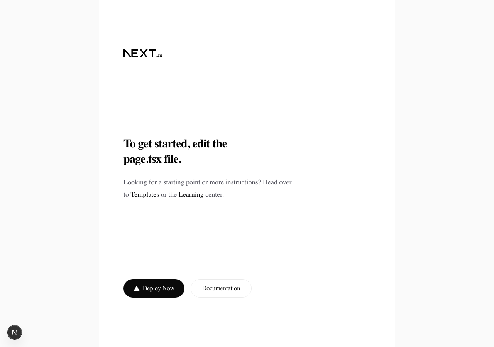
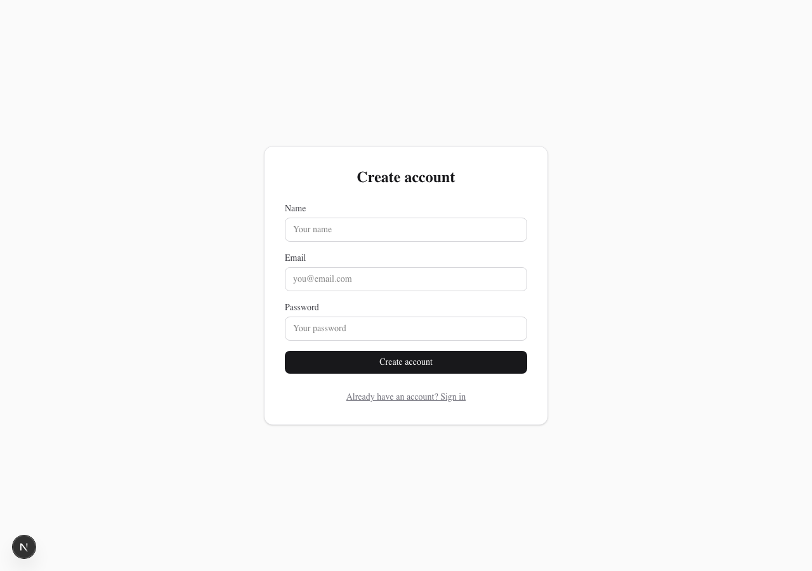
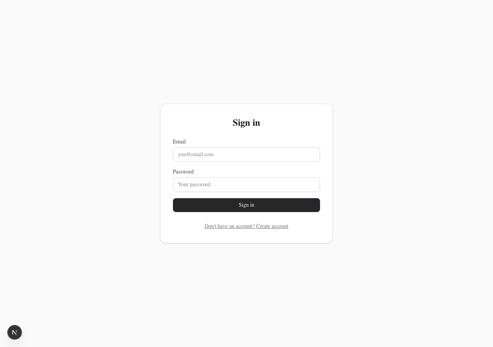
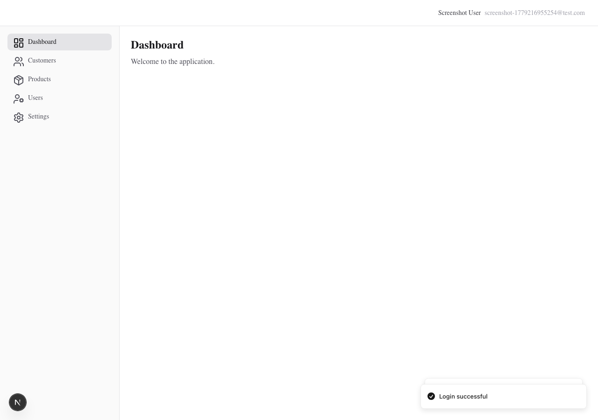
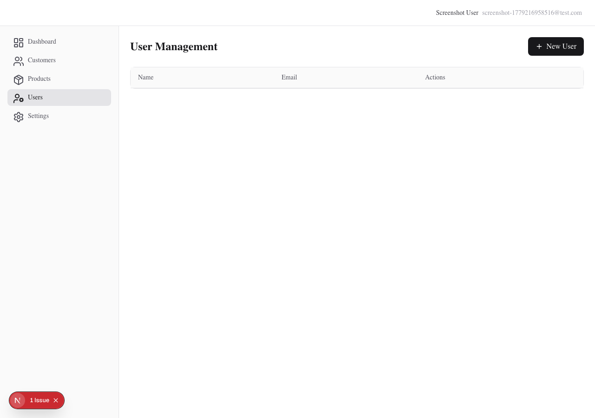
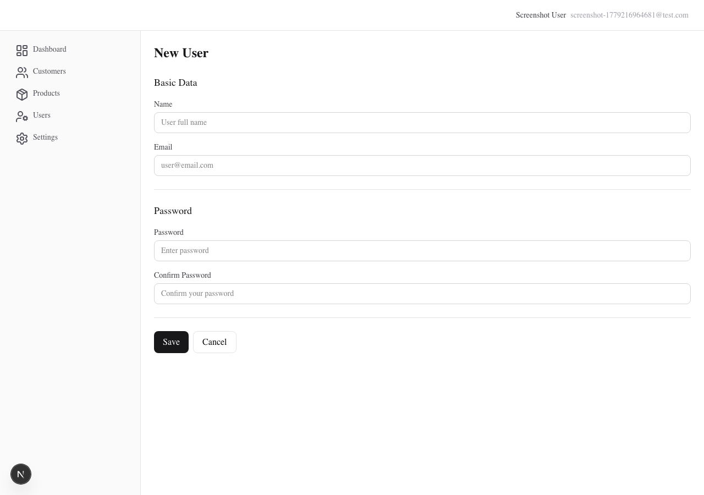
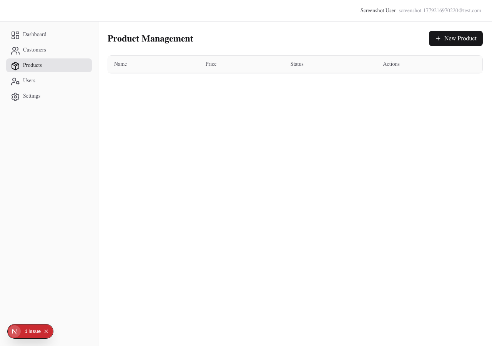
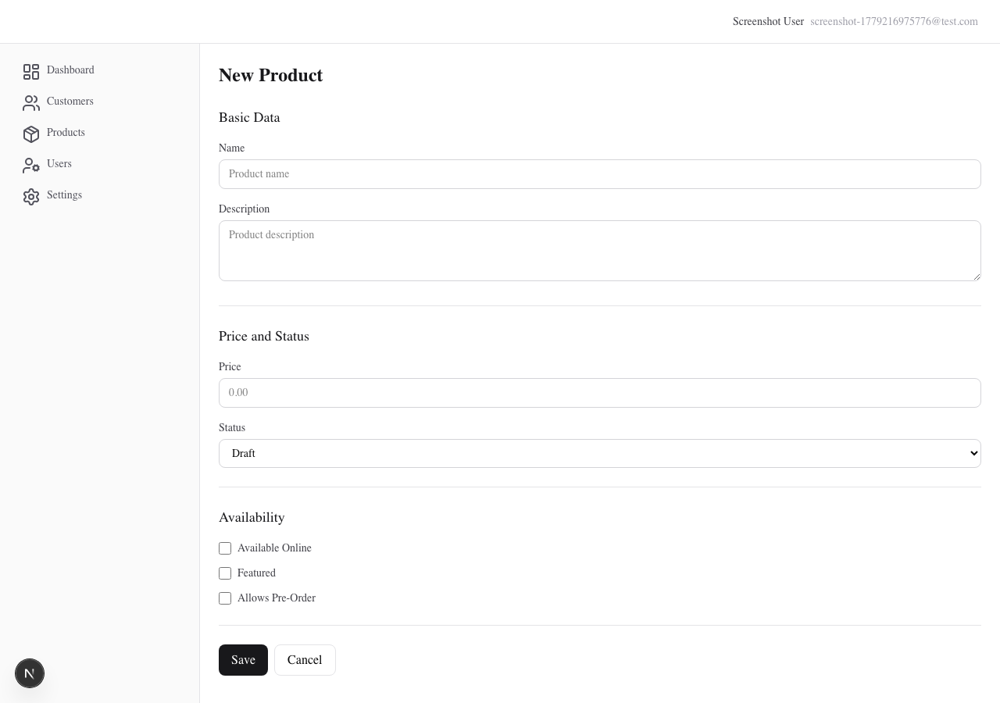

# Cadastro Base

Sistema web simples para organizar a base de clientes de um pequeno negócio, substituindo planilhas ou anotações espalhadas por um cadastro estruturado.

## Visão Geral

Este projeto é um **monorepo fullstack** construído com metodologia **SDD (Spec-Driven Development)** customizada — sem frameworks de automação de spec — utilizando **OpenCode** como IDE de IA e **LLMs gratuito: Qwen3.6 Plus Free**  para geração de código.

Cada funcionalidade nasce como uma **spec** em `.spec/changes/` que descreve a mudança **antes** da implementação, garantindo rastreabilidade completa do que foi feito e por quê.

## Screenshots das Telas

### Telas Públicas

#### Home (`/home`)



#### Cadastro (`/join` — modo registro)



#### Login (`/join` — modo login)



### Telas Privadas (autenticadas)

#### Dashboard (`/dashboard`)



#### Listagem de Usuários (`/users`)



#### Formulário de Usuário (`/users/new`)



#### Listagem de Produtos (`/catalog/products`)



#### Formulário de Produto (`/catalog/products/new`)



## Stack Tecnológica (100% Open Source)

| Camada | Tecnologia | Versão |
|--------|-----------|--------|
| Backend | Go + chi router | Go 1.26.3 |
| Frontend | Next.js (App Router) + React + TypeScript | Next.js 16.2.6 |
| UI | shadcn/ui + Tailwind CSS v4 | shadcn@4.7.0 |
| Banco | PostgreSQL | 17 (Alpine) |
| Persistência | `database/sql` puro (sem ORM) | — |
| Auth | JWT (golang-jwt/v5) + bcrypt | HS256 |
| Testes E2E | Playwright (Chromium) | — |
| Migrations | golang-migrate | — |
| Dev Server | air (hot reload Go) | — |
| Container | Docker Compose | — |

## Metodologia: SDD Customizada

O projeto utiliza **Spec-Driven Development** com ferramentas próprias, sem depender de frameworks externos:

### Como Funciona

1. **Spec primeiro** — Cada mudança começa como um arquivo `.md` em `.spec/changes/` descrevendo objetivo, contexto, tasks e resultado esperado
2. **Implementação guiada** — O agente de IA (OpenCode + LLM gratuito) lê a spec e implementa task por task
3. **Evidência registrada** — Cada task completada recebe um timestamp e descrição do que foi feito
4. **Validação** — Testes unitários, E2E e builds verificam a qualidade antes do encerramento

### Estrutura de Specs

```
.spec/
  changes/          # Specs de mudanças (uma por entrega)
    archive/        # Specs concluídas
      001-criar-projeto/spec.md
      002-cadastro-cliente/spec.md
      003-configurar-frontend/spec.md
      004-cadastro-cliente-frontend/spec.md
      005-login-usuario/spec.md
      006-cadastro-usuario/spec.md
      007-cadastro-produto/spec.md
  memory/           # Contexto global do projeto
    contexto-tecnico.md
    estrutura.md
    produto.md
  shared/           # Convenções reutilizáveis
    como-executar.md
    regras-de-nomenclatura.md
  templates/        # Modelos para novas specs
    modelo-base.md
    modelo-crud.md
```

### Skills Customizadas (OpenCode)

O projeto conta com **15+ skills** próprias no OpenCode que encapsulam padrões de implementação:

| Skill | Propósito |
|-------|-----------|
| `config-project-fullstack-go` | Cria monorepo Go + Next.js |
| `config-go-database` | Configura PostgreSQL com database/sql |
| `config-new-module-go` | Cria novo módulo Go |
| `module-aggregate-go` | Estrutura base de agregado |
| `module-entity-go` | Entidades com validação + testes |
| `module-repository-go` | Contrato de repositório + fake |
| `module-use-case-go` | Casos de uso com testes |
| `backend-go-config` | Middlewares, erros, JWT |
| `backend-go-handler` | Handlers HTTP com chi + testes |
| `backend-go-repository` | Repositório PostgreSQL |
| `backend-go-sync-module` | Migrations SQL |
| `backend-go-provider-implementation` | Providers técnicos |
| `shared-validation-rule-go` | Regras de validação reutilizáveis |
| `spec-backend-auth-basic-go` | Autenticação base completa |

## O Que Foi Implementado

### 7 Specs Entregues

| # | Spec | Descrição | Status |
|---|------|-----------|--------|
| 001 | Criar Projeto | Monorepo, chi, Next.js, shadcn, health check, middlewares | ✅ |
| 002 | Cadastro Cliente | CRUD completo de customer (backend + testes + migrations) | ✅ |
| 003 | Configurar Frontend | Estrutura shared, rotas public/private, sidebar | ✅ |
| 004 | Cadastro + Login Frontend | Tela /join com alternância cadastro/login, i18n, toasters, E2E | ✅ |
| 005 | Login + Auth | JWT, sessão cookie, AuthContext, AuthGuard, rotas protegidas, E2E | ✅ |
| 006 | CRUD Usuário | Save/delete user, listagem paginada, formulário, E2E | ✅ |
| 007 | CRUD Produto | Módulo catalog, Product aggregate, CRUD completo, frontend | ✅ |

### Módulos do Backend

```
apps/backend/internal/modules/
├── auth/                    # Autenticação e usuários
│   ├── models/              # User entity, erros de domínio
│   ├── services/            # AuthService, LoginUser, SaveUser, DeleteUser
│   ├── repositories/        # PostgresAuthRepository
│   ├── handlers/            # AuthHandler, UserHandler, rotas
│   ├── providers/           # BcryptCryptoProvider, CryptoProvider interface
│   └── jwt.go               # Geração de token JWT
├── customer/                # Cadastro de clientes
│   ├── models/              # Customer entity, erros
│   ├── services/            # CustomerService (save, deactivate)
│   ├── repositories/        # PostgresCustomerRepository
│   └── handlers/            # CustomerHandler, rotas
├── catalog/                 # Catálogo de produtos
│   ├── models/              # Product entity, ProductStatus enum, erros
│   ├── services/            # SaveProductUseCase, DeleteProductUseCase
│   ├── repositories/        # PostgresProductRepository
│   └── handlers/            # ProductHandler, rotas
├── middleware/              # ErrorHandler, Auth middleware
└── handlers/                # Health check
```

### Módulos do Frontend

```
apps/frontend/src/
├── app/
│   ├── (public)/            # Rotas públicas
│   │   ├── home/            # Página inicial
│   │   └── join/            # Cadastro + Login
│   └── (private)/           # Rotas protegidas (AuthGuard)
│       ├── dashboard/       # Painel principal
│       ├── users/           # CRUD de usuários
│       └── catalog/products/ # CRUD de produtos
├── modules/
│   ├── auth/                # Módulo de autenticação
│   │   ├── context/         # AuthContext (sessão, login, logout)
│   │   ├── guard/           # AuthGuard (proteção de rotas)
│   │   ├── components/      # PrivateShell, UserForm
│   │   └── util/            # JWT decoder (UTF-8 safe)
│   └── catalog/             # Módulo de catálogo
│       └── components/      # ProductForm
└── shared/                  # Código reutilizável
    ├── components/ui/       # shadcn/ui + componentes customizados
    ├── i18n/                # Internacionalização (pt/en)
    └── lib/                 # API client, hooks
```

### API Endpoints

| Método | Rota | Auth | Descrição |
|--------|------|------|-----------|
| GET | `/health` | Não | Health check |
| POST | `/auth/register` | Não | Cadastro de usuário |
| POST | `/auth/login` | Não | Login (retorna JWT) |
| GET | `/customers` | Sim | Listar clientes |
| POST | `/customers` | Sim | Criar cliente |
| GET | `/customers/{id}` | Sim | Buscar cliente |
| PUT | `/customers/{id}` | Sim | Atualizar cliente |
| DELETE | `/customers/{id}` | Sim | Inativar cliente (soft-delete) |
| GET | `/users` | Sim | Listar usuários (paginado) |
| POST | `/users` | Sim | Criar usuário |
| GET | `/users/{id}` | Sim | Buscar usuário |
| PUT | `/users/{id}` | Sim | Atualizar usuário |
| DELETE | `/users/{id}` | Sim | Excluir usuário |
| GET | `/products` | Sim | Listar produtos (paginado) |
| POST | `/products` | Sim | Criar produto |
| GET | `/products/{id}` | Sim | Buscar produto |
| PUT | `/products/{id}` | Sim | Atualizar produto |
| DELETE | `/products/{id}` | Sim | Excluir produto |

### Banco de Dados

| Tabela | Colunas Principais | Migrations |
|--------|-------------------|------------|
| `customers` | id, name, email (unique), phone, notes, active, timestamps | 001 |
| `users` | id, name, email (unique), password_hash, active, timestamps | 002 |
| `products` | id, name, description, price, status (enum), available_online, featured, allows_pre_order, timestamps | 003 |

### Testes

| Tipo | Quantidade | Cobertura |
|------|-----------|-----------|
| Model tests (Go) | 50+ | Entidades Customer, User, Product |
| Service tests (Go) | 28+ | Use cases de auth, customer, catalog |
| Repository tests (Go) | 10+ | Customer (PostgreSQL real) |
| Handler tests (Go) | 42+ | Customer handler + rotas chi |
| E2E (Playwright) | 13+ | Auth flow, user CRUD, join page |

## Arquitetura

### Princípios

- **Frontend não conhece o banco de dados** — comunicação via API REST (JSON)
- **Backend expõe casos de uso** — handlers chamam services, services orquestram repositories
- **Regras de negócio independentes da UI** — domínio puro em Go
- **Sem abstrações prematuras** — código simples e legível
- **Inativação = soft-delete** — campo `active`, não remoção de registro
- **Queries filtram `active = true`** por padrão

### Camadas do Backend

```
HTTP Request → Handler (chi) → Service (use case) → Repository (database/sql) → PostgreSQL
                              ↑
                         Domain Errors
                              ↓
                     Error Handler Middleware → JSON Response
```

### Separação de Responsabilidades

- **Módulo de negócio** (`modules/auth`) — não conhece JWT, token ou sessão
- **Handler** — gera JWT a partir da saída do caso de uso
- **Casos de uso de comando** — retornam `void` (apenas error)
- **Consultas** — handler chama repositório diretamente (não vira use case)

## Como Executar

### Pré-requisitos

- Go 1.26+
- Node.js 20+
- Docker + Docker Compose
- `migrate` tool (golang-migrate)
- `air` (hot reload Go, opcional)

### Iniciar Tudo

```bash
cd apps

# 1. Subir banco de dados
make db-up

# 2. Aplicar migrations
make db-migrate-up

# 3. Iniciar backend (hot reload)
make backend-up

# 4. Iniciar frontend (outro terminal)
make frontend-up
```

### Comandos Disponíveis

| Comando | Descrição |
|---------|-----------|
| `make db-up` | Inicia PostgreSQL |
| `make db-down` | Para PostgreSQL |
| `make db-migrate-up` | Aplica migrations pendentes |
| `make db-migrate-down` | Reverte última migration |
| `make backend-up` | Inicia backend com hot reload |
| `make frontend-up` | Inicia frontend dev server |
| `make test-e2e` | Roda testes E2E (headless) |
| `make test-e2e-ui` | Roda testes E2E (com browser) |
| `make all-up` | Sobe tudo (db + backend + frontend) |
| `make all-down` | Para tudo |

### Testes

```bash
# Backend - todos os testes
cd apps/backend && go test ./...

# Backend - package específico
cd apps/backend && go test ./internal/modules/customer/services/...

# Frontend - typecheck
cd apps/frontend && npx tsc --noEmit

# Frontend - E2E tests
cd apps/frontend && npx playwright test
```

## OpenCode + LLMs Gratuitos

Este projeto foi desenvolvido inteiramente com:

- **OpenCode** — IDE de IA CLI que orquestra a execução das specs
- **Skills customizadas** — 15+ templates de implementação específicos do projeto
- **LLMs gratuitos** — Modelos open source/free para geração de código
- **Sem frameworks de SDD** — Metodologia implementada com arquivos `.md` + convenções

### Fluxo de Trabalho

```
1. Criar spec em .spec/changes/<numero>-<nome>/spec.md
2. OpenCode lê a spec + skills relevantes
3. LLM gera código task por task
4. Testes validam a implementação
5. Evidência registrada na própria spec
6. Próxima spec...
```

## Estrutura do Projeto

```
.
├── .spec/                    # Spec-Driven Development
│   ├── changes/              # Specs de mudanças
│   ├── memory/               # Contexto global
│   ├── shared/               # Convenções
│   └── templates/            # Modelos de spec
├── .opencode/                # Skills customizadas do OpenCode
│   └── skills/               # 15+ skills de implementação
├── apps/
│   ├── backend/              # Go + chi + PostgreSQL
│   │   ├── cmd/server/       # Entry point
│   │   ├── config/           # Configuração de ambiente
│   │   ├── scripts/          # Migrations + HTTP tests
│   │   └── internal/         # Módulos de negócio
│   ├── frontend/             # Next.js + shadcn/ui
│   │   ├── src/app/          # Páginas e rotas
│   │   ├── src/modules/      # Módulos feature-based
│   │   ├── src/shared/       # Código reutilizável
│   │   └── tests/e2e/        # Testes Playwright
│   ├── docker-compose.yml    # PostgreSQL service
│   └── Makefile              # Comandos unificados
├── AGENTS.md                 # Instruções para agentes de IA
└── opencode.jsonc            # Configuração do OpenCode
```

## Regras de Negócio

### Cliente
- Nome e e-mail obrigatórios
- E-mail único (não pode repetir)
- Telefone opcional
- Cliente pode ser ativo ou inativo (soft-delete)

### Usuário
- Nome, e-mail e senha obrigatórios no cadastro
- Senha mínima: 6 caracteres
- E-mail único
- Edição mantém senha atual se campo vazio

### Produto
- Nome obrigatório (2-120 caracteres)
- Preço não-negativo, máximo 2 casas decimais
- Status: `active`, `inactive` ou `draft`
- Flags independentes: disponível online, destaque, permite pré-venda

## Licença

Open Source — projeto educacional.
